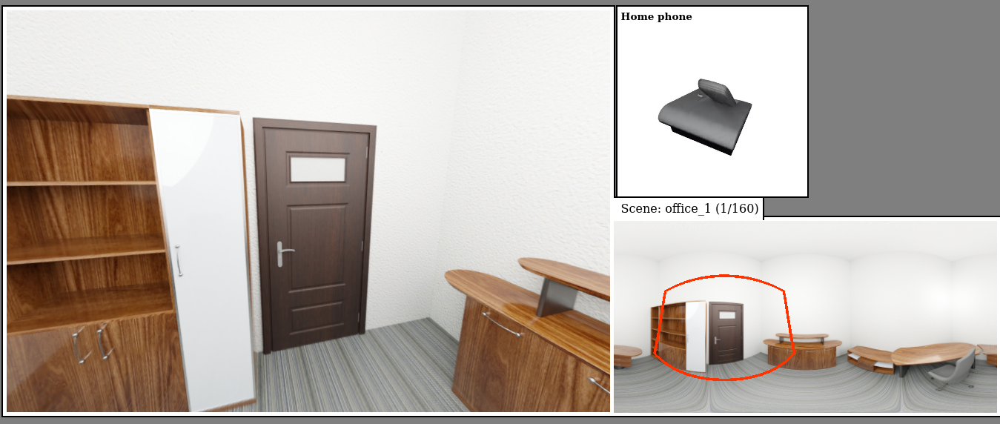

# "In search" pre-study protocol

For a coming experimental protocol we wish to know where objects might be placed in 3D indoor scenes (e.g., kitchen, living-room).
In particular we wish to get information about which objects would be found more often inside (e.g., in a cupboard) than outside (e.g., on a table), and which have strong spatial links to others (e.g., a pizza and a fridge).

We rendered 3D rooms as equirectangular maps (360 images) leaving only bigger objects (global objetcs) like tables and cupboards.
This 360 view appears in the lower right, whereas the "viewport" (rendering of the part within the red shape) is shown in the left. By clicking and dragging their mouse in the 360 view, participants move the "viewport" view.

They are given an object to place in the scene (here a home phone). They place it by clicking in the "viewport", they then answer a couple of questions about the object placement.

